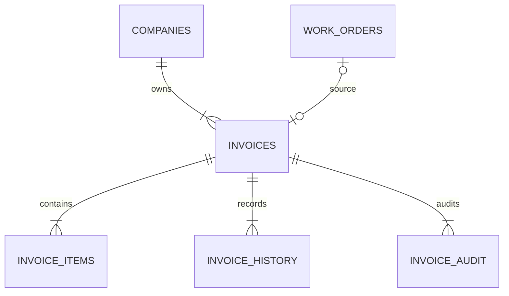

# Enterprise Invoice Engine

## Architecture

The invoice aggregate is created from the V3.3 billing projection and then becomes independent from its source Work Order. Customer, machine, company, technician, work-order, warranty, tax and total data are stored as immutable JSON snapshots. Line items store normalized financial columns plus their original source snapshot.

The implementation follows existing FastAPI, SQLAlchemy text-query, Decimal, tenant and transaction conventions. It intentionally does not introduce CQRS, an event bus or a repository framework.

## Aggregate

- `invoices`: aggregate root, status/type/currency, immutable snapshots and cancellation metadata.
- `invoice_items`: labor and part snapshots with tax, discount and warranty allocations.
- `invoice_history`: business lifecycle changes.
- `invoice_audit`: all access and action events including view and PDF download.
- `invoice_counters`: company/year/branch-prefix scoped atomic numbering.

## Decisions

1. Snapshots are authoritative after generation; source records are never joined for invoice reads.
2. Invoice numbers use an atomic counter scoped by company, calendar year and optional branch prefix.
3. All money, percentage and quantity calculations use the existing Decimal helpers.
4. `InvoiceType` and lifecycle fields prepare credit-note/reversal support, but financial reversal posting is intentionally deferred.
5. PDFs are generated on demand from stored snapshots and recorded in audit history.

## API

- `POST /api/invoices/generate`
- `GET /api/invoices`
- `GET /api/invoices/{id}`
- `GET /api/invoices/{id}/pdf`
- `POST /api/invoices/{id}/cancel`
- `GET /api/invoices/{id}/history`

OpenAPI schemas are generated by FastAPI from request models and route declarations.

## Known follow-up

Credit-note/refund/reversal accounting requires an approved finance-domain decision. The current schema reserves invoice type and status concepts without inventing ledger behavior.
